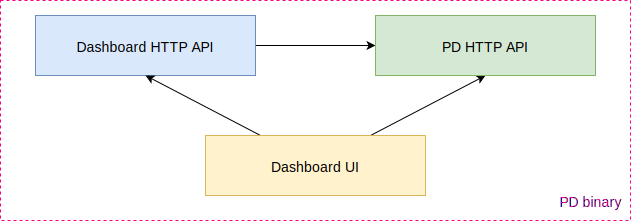
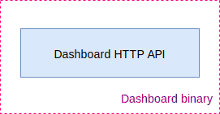
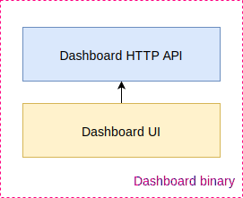
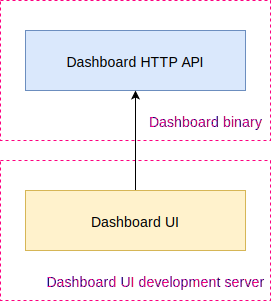
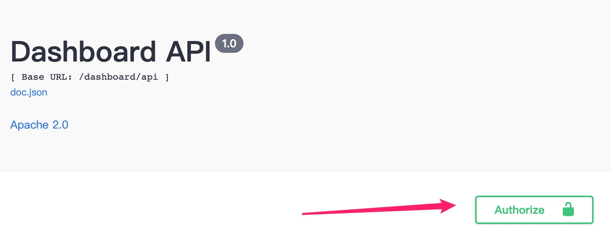

# TiDB Dashboard

TiDB Dashboard is a GUI interface to control a TiDB cluster via PD HTTP APIs. TiDB Dashboard can be integrated into PD, as follows:


This repository contains both Dashboard HTTP API and Dashboard UI. Dashboard HTTP API is placed in `pkg/` directory, written in Golang. Dashboard UI is placed in `ui/` directory, powered by React.

TiDB Dashboard can also live as a standalone binary for development.

If you're interested in contributing to TiDB Dashboard, or want to build it from source, see [CONTRIBUTING.md](./CONTRIBUTING.md).

## Getting Started: PD with TiDB Dashboard



The easiest way to use or play with TiDB Dashboard is to build [PD](https://github.com/pingcap/pd)
which integrates a recent TiDB Dashboard inside.

### Requirements

- Required: Go 1.13+ (please refer to [PD README](https://github.com/pingcap/pd) for details).

### Build Instructions

1. Clone PD:

   ```sh
   git clone https://github.com/pingcap/pd
   ```

2. Build PD server (which includes TiDB Dashboard by default):

   ```sh
   cd pd
   make pd-server
   ```

3. Start PD server with TiDB Dashboard enabled (both UI and API):

   ```sh
   bin/pd-server
   ```

4. Dashboard UI is available at http://127.0.0.1:2379/dashboard.

## Getting Started: Standalone Dashboard Server

Dashboard can also exist as a standalone binary. You may want this form in the following scenarios:

- You want to develop TiDB Dashboard.
- You want to use the most recent version of TiDB Dashboard.
- Your PD does not include the built-in TiDB Dashboard.

A standalone TiDB Dashboard Server contains the following components:

- Core Dashboard API server
- Swagger API explorer UI (optional)
- Dashboard UI server (optional)

### Requirements

- Required: Go 1.13+
- Optional: [Node.js](https://nodejs.org/) 12+ and [yarn](https://yarnpkg.com/) if you want to build
  the UI.

### Build Instructions

#### API Only



To build a dashboard server that only serves Dashboard API:

```sh
# under Dashboard directory:
make server
# make run
```

#### API + Swagger API UI

To build a dashboard server that serves both API and the Swagger API UI:

```sh
# under Dashboard directory:
make # or more verbose: SWAGGER=1 make server
# make run
```

You can visit the Swagger API UI via http://127.0.0.1:12333/dashboard/api/swagger.

#### Full Featured Build: API + Swagger API UI + Dashboard UI



Note: You need Node.js and yarn installed in order to build a full-featured dashboard server. See
Requirements section for details.

```sh
# under Dashboard directory:
make ui  # Build UI from source
SWAGGER=1 UI=1 make server
# make run
```

This will build a production-ready Dashboard server, which includes everything in a single binary.
You can omit the `make ui` step if the UI part is unchanged.

You can visit the Dashboard UI via http://127.0.0.1:12333/dashboard.

#### Dashboard UI Development



If you want to develop Dashboard UI, the recommended workflow is as follows:

1. Build Dashboard API Client

   Dashboard API Client is auto-generated from the Swagger spec, which is auto-generated from
   the Golang code. These code is not included in the repository. Thus, if you build UI for the
   first time (or backend interface has been changed), you need to build or rebuild the API client:

   ```bash
   # under Dashboard directory:
   make swagger_client
   ```

   The command above internally generates the Swagger spec first and then generates the Dashboard
   API client.

2. Build and Run Dashboard API Server

   Please refer to the Build Standalone Dashboard Server section. You must keep the Dashboard API
   backend server running for UI to work.

3. Start React Development Server

   ```sh
   # under Dashboard directory:
   cd ui
   npm start
   ```

   By default, the development UI will connect to local Dashboard API service at
   http://127.0.0.1:12333. Alternatively you can change the behaviour by specifying env variables:

   ```sh
   REACT_APP_DASHBOARD_API_URL=http://127.0.0.1:23456 npm start
   ```

   Currently the development server will not watch for Golang code changes, which means you must
   manually rebuild the Dashboard API Client if back-end code is updated (for example, you pulled
   latest change from the repository).

## For Developers How To ...

### Keep session valid after rebooting the server

By default, the session secret key is generated dynamically when the server starts. This results in invalidating
your previously acquired session token. For easier development, you can supply a fixed session secret key by
setting `DASHBOARD_SESSION_SECRET` in the environment variable or in `.env` file like:

```env
DASHBOARD_SESSION_SECRET=aaaaaaaaaabbbbbbbbbbccccccccccdd
```

The supplied secret key must be 32 bytes, otherwise it will not be effective.

Note: the maximum lifetime of a token is 24 hours by default, so you still need to acquire token every 24 hours.

### Supply session token in the Swagger UI

1. Acquire a token first through `/user/login` in the Swagger UI.

2. Click the "Authorize" button in the Swagger UI, set value to `Bearer xxxx` where `xxxx` is the token you acquired
   in step 1.

   

### Release new UI assets

Simply modify `ui/.github_release_version`. The assets will be released automatically after your change is merged
to master.
