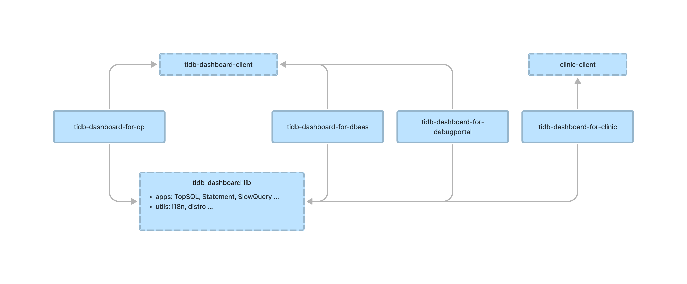

# TiDB Dashboard UI

## Arch

## Requirements

- Node >= 18.16.0
- [use corepack](https://www.totaltypescript.com/how-to-use-corepack): `corepack enable && corepack enable npm`

## Run

### Dev

1. `pnpm i`
1. `pnpm dev`

> Note:
>
> You can run `pnpm dev:op`, `pnpm dev:clinic-op`, `pnpm dev:clinic-cloud` only to start a specific dashboard variant, while `pnpm dev` starts all of them.
>
> Before starting `pnpm dev:clinic-op` and `pnpm dev:clinic-cloud`, you need to start clinic ui.

### Build

1. `pnpm i`
1. `pnpm build`
